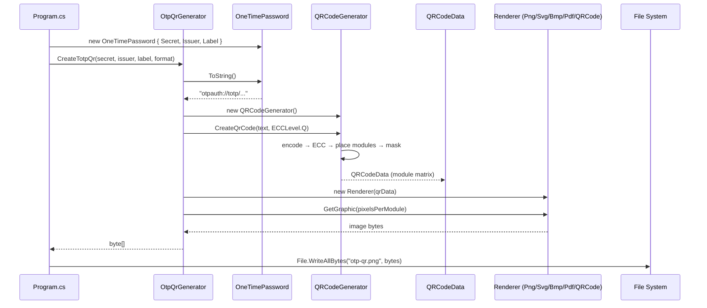

# QRCoder — Sequence Flow

The app (QRCoderSamples) builds a One-Time-Password QR code and saves it. 
Two views:
1. A high-level flow and a call-level flow/
2. An actual matching code path, plus the format and grid variants.

## 1. General Sequence Flow

```
[Application Start — Program.cs]
   ↓
[Build OTP payload — new OneTimePassword { Secret, Issuer, Label }]
   ↓
[OtpQrGenerator.CreateTotpQr()]
   ↓
[OneTimePassword.ToString()  →  "otpauth://totp/..." string]
   ↓
[Create QRCodeGenerator]
   ↓
[CreateQrCode()  →  encode text into QR matrix]
   ↓
[QRCodeData created  (module matrix)]
   ↓
[Select renderer for the chosen format  (PNG by default)]
   ↓
[GetGraphic()  →  produce image bytes]
   ↓
[File.WriteAllBytes("otp-qr.png")  →  save image file]
   ↓
[Process Complete]
```

## 2. Detailed Sequence Flow

```
Program (top-level Main)                              [Program.cs]
 ↓
new PayloadGenerator.OneTimePassword { Secret, Issuer, Label }
 ↓
OtpQrGenerator.CreateTotpQr(secret, issuer, label, format)
 ↓
OneTimePassword.ToString()                 → "otpauth://totp/MyApp:alice%40example.com?..."
 ↓
OtpQrGenerator.Render(payload, format, pixelsPerModule)
 ↓
new QRCodeGenerator()
 ↓
QRCodeGenerator.CreateQrCode(text, ECCLevel.Q)
 ↓
[encode → error correction → place modules → mask]
 ↓
new QRCodeData()                           (the module matrix)
 ↓
new PngByteQRCode(qrData)                  (renderer chosen by format)
 ↓
GetGraphic(pixelsPerModule)                → byte[]
 ↓
File.WriteAllBytes("otp-qr.png", bytes)
 ↓
End
```

## 3. Format variants (same flow, different renderer step)

The `Render()` step branches on the requested format:

```
format = Png   → new PngByteQRCode(data).GetGraphic(ppm)      → PNG  byte[]
format = Bmp   → new BitmapByteQRCode(data).GetGraphic(ppm)   → BMP  byte[]
format = Pdf   → new PdfByteQRCode(data).GetGraphic(ppm)      → PDF  byte[]
format = Svg   → new SvgQRCode(data).GetGraphic(ppm)          → SVG  text → UTF-8 bytes
format = Jpeg  → new QRCode(data).GetGraphic(ppm) → Bitmap    → Bitmap.Save(stream, Jpeg)
```

## 4. Grid variant (CreateTotpGrid — four accounts → one image)

```
OtpQrGenerator.CreateTotpGrid(accounts, format)
 ↓
[loop per account]  OneTimePassword.ToString() → CreateQrCode() → new QRCode(data).GetGraphic(ppm) → Bitmap
 ↓
ComposeGrid(tiles)          → Graphics.DrawImage each tile into a 2x2 canvas
 ↓
EncodeBitmap(composite)     → Bitmap.Save(stream, Png/Jpeg/Bmp) → byte[]
 ↓
File.WriteAllBytes("otp-grid.png", bytes)
 ↓
End
```

## 5. UML sequence diagram (Mermaid — renders on GitHub / exports to Word)


